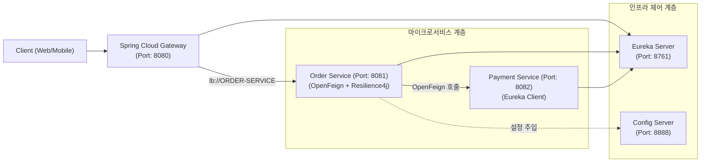

# Spring Cloud In Action (스프링 클라우드 분산 시스템 실습)

본 프로젝트는 블로그 글 **「Spring Cloud 개요 및 분산 시스템 아키텍처」** 에 소개된 핵심 분산 시스템 아키텍처 패턴을 실습할 수 있도록 구성된 Gradle 멀티 모듈 프로젝트입니다.

---

## 1. 프로젝트 모듈 구성 및 아키텍처

```
spring-cloud-in-action/
├── config-server/       # 중앙 집중식 환경 설정 서버 (포트: 8888)
├── discovery-service/   # Eureka 기반 서비스 레지스트리 서버 (포트: 8761)
├── api-gateway/         # Netty 기반 Spring Cloud Gateway (포트: 8080)
├── order-service/       # 주문 마이크로서비스 (OpenFeign + Circuit Breaker + @RefreshScope) (포트: 8081)
└── payment-service/     # 결제 마이크로서비스 (포트: 8082)
```



---

## 2. 블로그 코드 대응 매핑

| 블로그 섹션 | 설명 | 구현 위치 |
|---|---|---|
| **3.1 Spring Cloud Config** | 중앙 설정 관리 및 동적 갱신 (`@RefreshScope`) | `config-server/`<br/>`order-service/.../config/OrderProperties.java` |
| **3.2 Eureka Server** | 서비스 레지스트리 서버 | `discovery-service/.../DiscoveryServiceApplication.java` |
| **3.3 Spring Cloud Gateway** | 비동기 라우팅 & 서킷 브레이커 필터 | `api-gateway/src/main/resources/application.yml`<br/>`api-gateway/.../controller/FallbackController.java` |
| **3.4 OpenFeign** | 선언적 REST 클라이언트 & Fallback | `order-service/.../client/PaymentClient.java`<br/>`order-service/.../client/PaymentClientFallback.java` |
| **3.5 Resilience4j Circuit Breaker** | 결함 감내 및 서킷 오픈 / Fallback | `order-service/.../service/OrderService.java` |

---

## 3. 서비스 실행 순서

각 모듈을 실행할 때는 의존성을 고려하여 아래 순서대로 실행합니다:

```bash
# 1. Config Server 실행
./gradlew :config-server:bootRun

# 2. Eureka Discovery Service 실행 (http://localhost:8761 접속 확인)
./gradlew :discovery-service:bootRun

# 3. Payment Service 실행
./gradlew :payment-service:bootRun

# 4. Order Service 실행
./gradlew :order-service:bootRun

# 5. API Gateway 실행
./gradlew :api-gateway:bootRun
```

---

## 4. 실습 및 동작 검증 시나리오

### 4.1 API Gateway를 통한 단일 진입점 라우팅
```bash
# Gateway(8080)를 거쳐 Order Service(8081)로 요청 전달
curl -i http://localhost:8080/api/orders/ORD-1001

# Gateway 필터에 의해 'X-Gateway-Tracking-Id' 헤더가 주입되어 반환됨
```

### 4.2 OpenFeign 및 Resilience4j 서킷 브레이커 정상 동작
```bash
# 정상 결제 처리 요청 (OrderService -> OpenFeign -> PaymentService)
curl -X POST http://localhost:8081/api/orders/ORD-1001/pay
```
**응답:**
```json
{
  "orderId": "ORD-1001",
  "paymentStatus": "COMPLETED",
  "trackingId": "N/A"
}
```

### 4.3 원격 결제 서비스 장애 시 Fallback 동작
Payment Service를 중단하거나 에러를 유발하는 경우:
```bash
# OrderService 호출 시 결제 장애가 감지되면 fallbackProcessOrderPayment 가 즉시 동작
curl -X POST http://localhost:8081/api/orders/ORD-9999/pay
```
**응답:**
```json
{
  "orderId": "ORD-9999",
  "paymentStatus": "PAYMENT_PENDING_FALLBACK",
  "trackingId": "N/A"
}
```

### 4.4 Spring Cloud Config 동적 갱신 (@RefreshScope)
1. 현재 할인율 조회:
```bash
curl http://localhost:8081/api/orders/discount
```
2. Config Server 설정 갱신 후 Actuator refresh 트리거:
```bash
curl -X POST http://localhost:8081/actuator/refresh
```

---

## 5. 빌드 및 테스트 실행

```bash
# 전체 모듈 빌드 및 단위/통합 테스트 실행
./gradlew clean test
```
