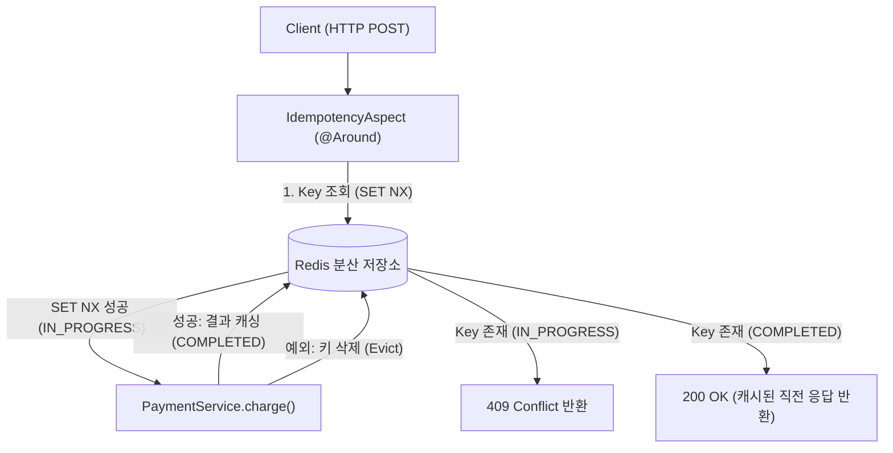

# Spring Idempotency AOP (Spring Boot & Redis 기반 멱등성 보장 시스템)

본 프로젝트는 블로그 글 **「Spring 환경에서 Idempotency Key를 활용한 중복 요청 방지 및 멱등성 보장」** 에 소개된 AOP 기반 멱등성 제어 프레임워크 실습 프로젝트입니다.

---

## 프로젝트 개요 및 아키텍처

네트워크 타임아웃, 클라이언트 자동 재시도, 사용자의 중복 클릭(Double Submit)으로 인한 결제/주문 중복 처리를 방지하기 위해 **Idempotency-Key** 와 **Redis 분산 캐시**를 결합한 선언적 AOP 프레임워크를 제공합니다.

```
spring-idempotency-aop/
├── src/main/java/com/example/blog/
│   ├── SpringIdempotencyAopApplication.java
│   ├── common/
│   │   ├── config/
│   │   │   └── RedisConfig.java                 # RedisTemplate 및 직렬화 설정
│   │   └── idempotency/
│   │       ├── Idempotent.java                  # 선언적 멱등성 어노테이션 (@Idempotent)
│   │       ├── IdempotencyRecord.java           # 멱등성 상태 머신 (IN_PROGRESS, COMPLETED)
│   │       └── IdempotencyAspect.java           # AOP 인터셉터 (SET NX 선점, 캐시 응답, 롤백)
│   └── payment/
│       ├── controller/PaymentController.java    # @Idempotent 적용된 결제 API 컨트롤러
│       ├── dto/PaymentRequest.java
│       ├── dto/PaymentResponse.java
│       └── service/PaymentService.java          # 결제 처리 비즈니스 로직
└── src/test/java/com/example/blog/
    ├── common/idempotency/IdempotencyAspectTest.java      # AOP 상태별 단위 테스트
    ├── payment/controller/PaymentControllerTest.java     # 컨트롤러 단위 테스트
    └── payment/PaymentIdempotencyIntegrationTest.java    # 멱등성 E2E 통합 테스트
```



---