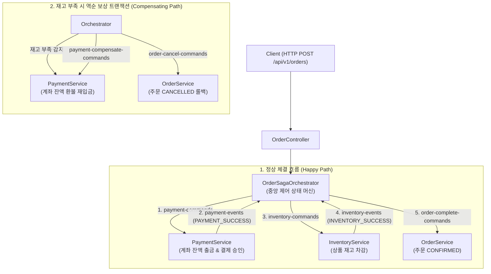
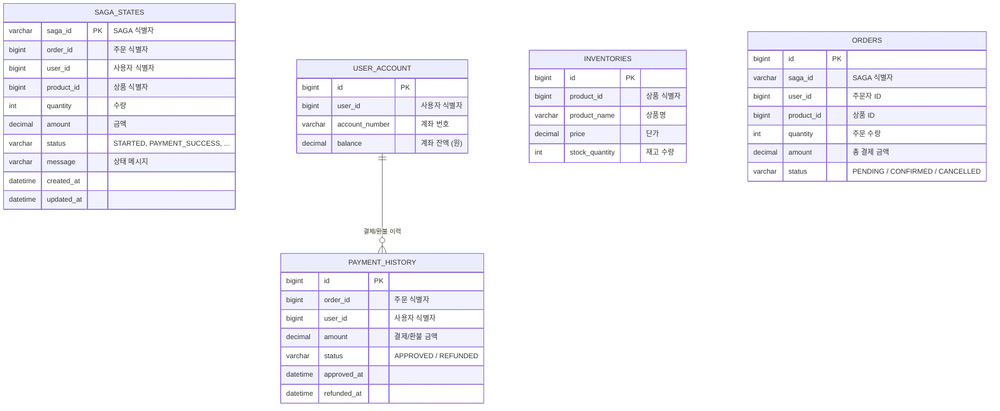

# Spring SAGA Orchestrator (Spring Boot, Kafka & JPA 기반 분산 트랜잭션 및 보상 트랜잭션 시스템)

본 프로젝트는 블로그 글 「SAGA 패턴을 활용한 분산 트랜잭션과 보상 트랜잭션 구현」에 소개된 오케스트레이션 기반 SAGA 패턴(Orchestration-based SAGA Pattern) 실습 프로젝트입니다.

현실적인 이커머스 금융/결제 시나리오를 반영하여 사용자 계좌(`UserAccount`), 결제 이력(`PaymentHistory`), 재고(`Inventory`), 주문(`OrderEntity`), SAGA 상태(`OrderSagaState`)를 JPA와 데이터베이스로 영속화하고, 실제 계좌 잔액 출금 및 환불 보상 트랜잭션(Compensating Transaction)을 시뮬레이션합니다.

---

## 1. 시스템 아키텍처 및 데이터 모델

### 1.1 SAGA 오케스트레이션 이벤트 흐름


### 1.2 JPA 도메인 모델 (ERD)


---

## 2. 프로젝트 디렉토리 구조

```
spring-saga-orchestrator/
├── build.gradle
├── http/
│   └── order-saga.http                      # HTTP Client 원클릭 시나리오 테스트
├── src/main/java/com/example/springsagaorchestrator/
│   ├── SpringSagaOrchestratorApplication.java
│   ├── config/
│   │   ├── KafkaConfig.java                 # 7개 Kafka 토픽 생성 및 직렬화 설정
│   │   └── DataInitializer.java             # 테스트용 계좌(10만 원) 및 재고 초기 데이터 적재
│   ├── saga/
│   │   ├── model/
│   │   │   └── OrderSagaState.java          # SAGA 상태 머신 JPA 엔티티
│   │   ├── repository/
│   │   │   └── OrderSagaStateRepository.java # SAGA 상태 RDB 저장소
│   │   └── orchestrator/
│   │       └── OrderSagaOrchestrator.java   # 중앙 오케스트레이터 (Kafka 이벤트 조율자)
│   ├── account/
│   │   ├── domain/UserAccount.java          # 사용자 계좌 엔티티 (debit / credit)
│   │   ├── repository/UserAccountRepository.java
│   │   └── controller/AccountController.java # 계좌 잔액 실시간 조회 API
│   ├── payment/
│   │   ├── domain/PaymentHistory.java       # 결제/환불 이력 엔티티
│   │   ├── repository/PaymentHistoryRepository.java
│   │   └── service/PaymentService.java      # 계좌 출금 및 환불(보상) 트랜잭션 리스너
│   ├── inventory/
│   │   ├── domain/Inventory.java            # 재고 엔티티 (decreaseStock / increaseStock)
│   │   ├── repository/InventoryRepository.java
│   │   ├── service/InventoryService.java    # 재고 차감 리스너
│   │   └── controller/InventoryController.java # 상품 재고 실시간 조회 API
│   └── order/
│       ├── domain/OrderEntity.java          # 주문 엔티티 (PENDING, CONFIRMED, CANCELLED)
│       ├── repository/OrderRepository.java
│       ├── dto/OrderCreateRequest.java
│       ├── dto/OrderResponse.java
│       ├── service/OrderService.java        # 주문 생성 및 상태 갱신 리스너
│       └── controller/OrderController.java  # 주문 접수 및 SAGA 상태 조회 API
└── src/test/java/com/example/springsagaorchestrator/
    ├── saga/orchestrator/OrderSagaOrchestratorTest.java # 오케스트레이터 단위 테스트
    ├── payment/service/PaymentServiceTest.java          # 계좌 잔액 출금/환불 단위 테스트
    ├── inventory/service/InventoryServiceTest.java      # 재고 차감 및 품절 단위 테스트
    ├── order/controller/OrderControllerTest.java        # 주문 API 단위 테스트
    └── SpringSagaOrchestratorApplicationTests.java      # EmbeddedKafka 통합 컨텍스트 테스트
```

---

## 3. 실행 및 시나리오 검증 방법

### 3.1 프로젝트 빌드 및 단위/통합 테스트
```bash
cd spring/spring-saga-orchestrator
./gradlew clean test
```

### 3.2 애플리케이션 실행
```bash
# Kafka 브로커(localhost:9092) 실행 후 스프링 부트 기동 (H2 DB 콘솔: http://localhost:8080/h2-console)
./gradlew bootRun
```

### 3.3 HTTP Client 테스트 (order-saga.http)

#### 1) 초기 시드 데이터 확인
- User 1번 계좌: 100,000원 (`GET /api/v1/accounts/users/1`)
- User 2번 계좌: 5,000원 (`GET /api/v1/accounts/users/2`)
- Product 1번 재고: 100개 (`GET /api/v1/inventories/products/1`)
- Product 999번 재고: 0개 품절 (`GET /api/v1/inventories/products/999`)

#### 2) 시나리오 1: 정상 주문 체결 (Happy Path)
```bash
curl -i -X POST http://localhost:8080/api/v1/orders \
  -H "Content-Type: application/json" \
  -d '{"userId": 1, "productId": 1, "quantity": 1, "amount": 50000}'
```
- 결과:
  - User 1 계좌에서 50,000원 출금 (100,000원 -> 50,000원)
  - Product 1 재고 1개 차감 (100개 -> 99개)
  - SAGA 상태: COMPLETED, 주문 상태: CONFIRMED

#### 3) 시나리오 2: 재고 부족 실패 및 역순 보상 트랜잭션 (Compensating Path)
```bash
curl -i -X POST http://localhost:8080/api/v1/orders \
  -H "Content-Type: application/json" \
  -d '{"userId": 1, "productId": 999, "quantity": 1, "amount": 70000}'
```
- 결과:
  - 1단계: 결제 서비스에서 User 1 계좌로부터 70,000원 임시 출금 성공 (PAYMENT_SUCCESS)
  - 2단계: 재고 서비스에서 품절 상품(Product 999) 감지로 재고 차감 실패 (FAILED)
  - 3단계: 오케스트레이터가 payment-compensate-commands 발행 -> 보상 트랜잭션이 User 1 계좌로 70,000원 즉시 환불 재입금
  - 최종 상태: User 1 계좌 잔액 원복 확인, 주문 상태: CANCELLED

#### 4) 시나리오 3: 결제 잔액 부족 실패 (Fast-Fail Path)
```bash
curl -i -X POST http://localhost:8080/api/v1/orders \
  -H "Content-Type: application/json" \
  -d '{"userId": 2, "productId": 1, "quantity": 1, "amount": 50000}'
```
- 결과:
  - 잔액 부족(5,000원 < 50,000원)으로 1단계 결제 즉시 실패 -> 재고 차감 없이 주문 즉시 취소(CANCELLED)
